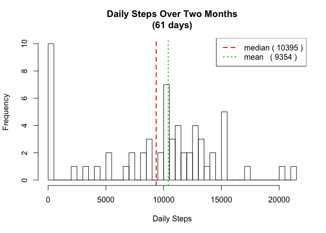
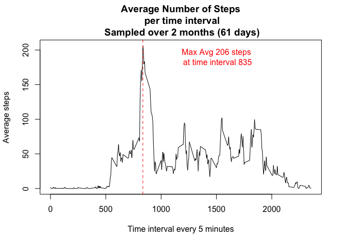
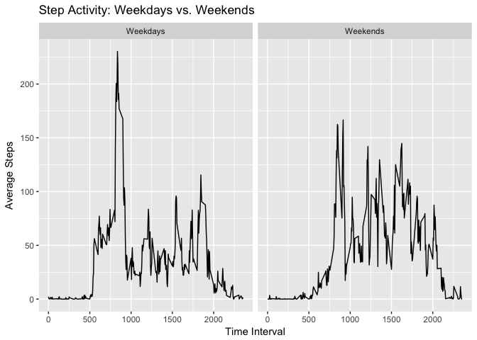

Step Analyzer
================

Introduction
============

It is now possible to collect a large amount of data about personal movement using activity monitoring devices such as a Fitbit, Nike Fuelband, or Jawbone Up.

This assignment makes use of data from a personal activity monitoring device. This device collects data at 5 minute intervals through out the day. The data consists of two months of data from an anonymous individual collected during the months of October and November, 2012 and include the number of steps taken in 5 minute intervals each day.

Activity Data
-------------

The variables included in this dataset are:

-   steps: Number of steps taking in a 5-minute interval (missing values are coded as 𝙽𝙰)
-   date: The date on which the measurement was taken in YYYY-MM-DD format
-   interval: Identifier for the 5-minute interval in which measurement was taken

The dataset is stored in a comma-separated-value (CSV) file and there are a total of 17,568 observations in this dataset.

Open the dataset:

``` r
ds <- read.csv("activity.csv")
```

Activity Report
---------------

### Total Number of Steps taken each day

``` r
cStepsDaily <- with(ds, tapply( steps, date, sum, na.rm=T))
cDates <- unique(ds$date)
hist(cStepsDaily, breaks=60, xlab="Daily Steps", ylab="Frequency", main="Daily Steps Over Two Months\n (61 days) ")

# The mean and median step values 
mn <-mean(cStepsDaily)
md <-median(cStepsDaily)

# draw mean and medianon the histogram, and write on the legend
abline(v=mn, untf=FALSE, col=2, lty=2, lwd=2)
abline(v=md, untf=FALSE, col=3, lty=3, lwd=2)
t1<-paste("median (",format(md,digits=0),")")
t2<-paste("mean   (",format(mn,digits=0),")")
legend("topright", c(t1,t2), col=2:3, lty=2:3, lwd=2)
```



### Time Series Plot Average Number of Steps Taken (plot)

``` r
cStepsInterval <- with(ds, tapply( steps, interval, mean, na.rm=T))
cIntervals <-unique(ds$interval)

plot(cIntervals, cStepsInterval, type="l", xlab="Time interval every 5 minutes",ylab="Average steps",main="Average Number of Steps\n per time interval\n Sampled over 2 months (61 days)")

# Include 5-minute interval with avg. maximum number of steps
dfTimeAvg <- data.frame(steps = cStepsInterval,
                  interval = cIntervals)
# find the maximum step average
x<-max(dfTimeAvg$steps)
# lookup the step in the table and return the interval
i <- dfTimeAvg[dfTimeAvg$steps==x,]$interval
# formate the step average to be more presentable
y <- format(x,digits=0)
# Create an output string
t <-paste("Max Avg",y,"steps\n at time interval",i)
# print the information of the maximum number of steps
text(1500,x-16,t, col=2)
# add a vertical line indicating the time intervale.
abline(v=i, col=2, lty=2)
```



### Code to describe and show a strategy for computing missing data

``` r
# Make a copy of the data set with missing values so the original dataset is preserved
ds2 <- ds

# Find the missing step values
n <- is.na(ds$steps)

# Lookup each missing steps value (n) in the data set (ds) by 
# its time interval value (ds[n,3]), and lookup the time interval
# in the Interval Average table (dfTimeAvg). Use the 
# average steps (c(1))) to replace the missing step value ([n,1])
# in the copy of the original data set (ds2)

ds2[n,1] <- dfTimeAvg[as.character(ds[n,3]),c(1)]

nMissingSteps = sum(n)
t <- paste("There are", nMissingSteps, "missing step intervals.")
print(t)
```

    ## [1] "There are 2304 missing step intervals."

### Total Number of Steps Taken Each Day (NA computed and included)

``` r
cStepsDaily <- with(ds2, tapply( steps, date, sum, na.rm=T))
cDates <- unique(ds2$date)
hist(cStepsDaily, breaks=60, xlab="Daily Steps", ylab="Frequency", main="Daily Steps Over Two Months\n (61 days) ")
 
abline(v=mean(cStepsDaily), untf=FALSE, col=2, lty=2, lwd=2)
abline(v=median(cStepsDaily), untf=FALSE, col=3, lty=3, lwd=2)
legend("topright", c("median","mean"), col=2:3, lty=2:3, lwd=2)
```


### Panel plot comparing the average number of steps taken per 5-minute intervals across weekdays and weekends (NAs imputed)

``` r
library(ggplot2)
cDays <- weekdays(as.Date(ds2[,2]), abbreviate = TRUE)
```

    ## Warning in strptime(xx, f <- "%Y-%m-%d", tz = "GMT"): unknown timezone
    ## 'default/America/Los_Angeles'

``` r
n = cDays  == "Sun" | cDays == "Sat"

dsWeekdays <- ds2[!n,]

cStepsIntervalWeekdays <- with(dsWeekdays, tapply( steps, interval, mean, na.rm=T))
cIntervalsWeekdays <-unique(dsWeekdays$interval)

dsWeekends <- ds2[n,]
cStepsIntervalWeekends <- with(dsWeekends, tapply( steps, interval, mean, na.rm=T))
cIntervalsWeekends <-unique(dsWeekends$interval)

dfWeekday <- data.frame(
  steps = cStepsIntervalWeekdays,
  interval = cIntervalsWeekdays,
  daytype = "Weekdays"
)

dfWeekend <- data.frame(
  steps = cStepsIntervalWeekends,
  interval = cIntervalsWeekends,
  daytype = "Weekends"
)

df <- rbind(dfWeekday,dfWeekend)

ggplot(df, aes(interval,steps)) +
  geom_line() + facet_grid(. ~ daytype)+
  xlab("Time Interval") +ylab("Average Steps") +
  ggtitle("Step Activity: Weekdays vs. Weekends")
```


